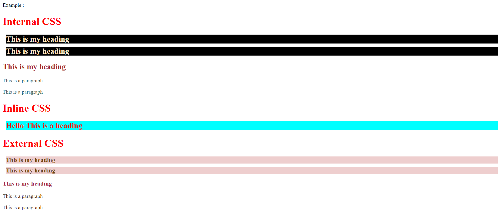
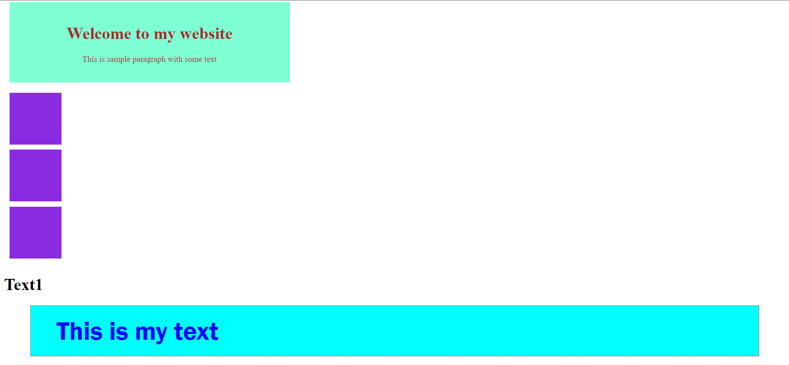

# CSS NOTES

## Inline CSS , Internal CSS , External CSS

### CSS
__CSS stands for Cascading Style Sheets.__ It is a style sheet language used to describe the presentation and formatting of HTML, XHTML, and XML documents. CSS allows web developers to separate the content and structure of a web page from its presentation, allowing for more flexibility and control over the appearance of the page. With CSS, developers can define styles for elements such as fonts, colors, margins, borders, and layout, and apply those styles to specific elements or groups of elements throughout the web page. 

### Importance :
- Separation of content and presentation: CSS allows you to separate the content and presentation of a web page. This means you can write clean HTML code that describes the structure of the content, and use CSS to define the visual style and layout of the page. This separation makes it easier to maintain and update a website.
- Consistency: By defining a consistent style for your website, you can create a cohesive look and feel that helps to build your brand identity. CSS also makes it easier to ensure consistency across multiple pages of a website.
- Responsiveness: With CSS, you can create responsive web pages that adjust to different screen sizes and devices. This is crucial for ensuring that your website is accessible to a wider audience, including those using mobile devices.
- Flexibility: CSS provides a lot of flexibility when it comes to styling web pages. You can control the appearance of individual elements, apply styles to groups of elements, and create reusable styles that can be applied across multiple pages.
- Accessibility: CSS makes it easier to create accessible websites by allowing you to control the presentation of content without compromising the underlying structure. This makes it easier for screen readers and other assistive technologies to navigate and interpret your website.

### CSS naming conventions and organization :
CSS naming conventions and organization are essential for creating maintainable and scalable CSS code. They help to make the code more understandable, reduce code duplication, and improve collaboration between team members. Here are some of the commonly used CSS naming conventions and organization techniques:
- BEM (Block Element Modifier) - BEM is a naming convention that uses a class naming system to define blocks, elements, and modifiers in CSS. It helps to create reusable and maintainable code by providing a clear structure and hierarchy.
- SMACSS (Scalable and Modular Architecture for CSS) - SMACSS is a set of guidelines for organizing and managing CSS code. It emphasizes on the separation of concerns by dividing styles into base, layout, module, state, and theme.
- Atomic CSS - Atomic CSS is a naming convention that uses atomic classes to define specific CSS properties. It helps to create reusable and modular code by providing a limited set of classes that can be combined to create any style.
- OOCSS (Object-Oriented CSS) - OOCSS is a methodology that emphasizes on creating reusable and modular CSS code by separating structure and skin. It uses objects to represent reusable and independent components in CSS.
- ITCSS (Inverted Triangle CSS) - ITCSS is a methodology that organizes CSS code based on specificity and inheritance. It defines styles in a hierarchical order from global to local, making it easier to manage and maintain large CSS codebases.
- SMIT (Single-Responsibility Media-Independent CSS) - SMIT is a naming convention that separates CSS code based on device-independent properties and media-specific properties. It helps to create flexible and scalable CSS code that can adapt to different devices and media types.

### Basic syntax and structure :
```css
selector {
  property: value;
}
```

- Selector: It is the HTML element, class, ID, or attribute to which the CSS styles are applied. It specifies the target element(s) for styling.
- Property: It is the attribute of the element that you want to style. It represents the aspect of the element that you want to change, such as color, font-size, margin, padding, etc.
- Value: It is the assigned value for the property. It specifies how you want to change the appearance or behavior of the element.


### Types Of CSS :
1. Inline CSS: Inline CSS is applied directly to an HTML element using the style attribute. The syntax is as follows:
```html
<element style="property: value;">
```

2. Internal CSS: Internal CSS is defined within the head section of an HTML document using the <style> tag. The syntax is as follows:
```html
<head>
  <style>
    selector {
      property: value;
    }
  </style>
</head>
```
3. External CSS: External CSS is defined in a separate CSS file and linked to an HTML document using the <link> tag. The syntax is as follows:
```html
<head>
  <link rel="stylesheet" type="text/css" href="path/to/file.css">
</head>
Example  :
<!DOCTYPE html>
<html lang="en">
<head>
    <meta charset="UTF-8">
    <meta http-equiv="X-UA-Compatible" content="IE=edge">
    <meta name="viewport" content="width=device-width, initial-scale=1.0">
    <title>Document</title>
    <link rel="stylesheet" href="./Style.css"/>
</head>
<style>
    h1{
        color:red;
    }
    .myHead{
        color:bisque;
    background-color: black;
    margin: 10px;
    }
    #mythirdelement{
        color: brown;
    }
    .myptag{
        color: rgb(24, 91, 102);
    }
</style>
<body>
    <h1>Internal CSS</h1>
    <h2 class="myHead">This is my heading</h2>
    <h2 class="myHead">This is my heading</h2>
    <h2 id="mythirdelement">This is my heading</h2>
    <p class="myptag">This is a paragraph</p>
    <p class="myptag">This is a paragraph</p>
    <h1>Inline CSS</h1>
    <h2 style="color: red;background-color:aqua;margin:10px;">Hello This is a heading</h2>
    <h1>External CSS</h1>
    <h3 class="myHeadex">This is my heading</h3>
    <h3 class="myHeadex">This is my heading</h3>
    <h3 id="mythirdelementex">This is my heading</h3>
    <p class="myptagex">This is a paragraph</p>
    <p class="myptagex">This is a paragraph</p>
</body>
</html>
``` 
**CSS**
```css
h3{
    color:rgb(114, 52, 156);
}
.myHeadex{
    color:rgb(112, 72, 24);
background-color: rgb(238, 206, 206);
margin: 10px;
}
#mythirdelementex{
    color: rgb(165, 42, 73);
}
.myptagex{
    color: rgb(63, 38, 7);
}
```

### Ouput:



## Styling Container & Text Formatting

In CSS, classes and IDs are used to apply styles to specific HTML elements on a page. Both classes and IDs are defined using a selector followed by a name, and then enclosed in curly brackets.

The syntax for defining a class in CSS is:
```css
.class-name {
  /* CSS rules */
}
```
Here, .class-name is the selector for the class, followed by the CSS rules that apply to elements with that class.

The syntax for defining an ID in CSS is:
```css
#id-name {
  /* CSS rules */
}
```
Here, #id-name is the selector for the ID, followed by the CSS rules that apply to elements with that ID.

Classes are often used to apply styles to multiple elements that share a common set of characteristics, while IDs are typically used to apply styles to a single, unique element on a page.

To apply a class or ID to an HTML element, you can use the class and id attributes, respectively. For example:
```html
<div class="box" id="main-box"></div>
```
Here, the div element has a class of "box" and an ID of "main-box", which can be used to apply styles to that element in CSS.

Some commonly used CSS properties that are often applied to classes and IDs include padding, margin, display, flex-direction, and justify-content.

padding is used to create space within an element's content area.
margin is used to create space outside of an element's border.
display is used to control how an element is displayed on the page.
flex-direction is used to specify the direction of a flex container's main axis.
justify-content is used to align flex items along the main axis of a flex container.
Example :

```html
<!DOCTYPE html>
<html lang="en">
<head>
    <meta charset="UTF-8">
    <meta http-equiv="X-UA-Compatible" content="IE=edge">
    <meta name="viewport" content="width=device-width, initial-scale=1.0">
    <title>Document</title>
</head>
<style>
    .container{
        background-color: aquamarine;
        padding: 20px;
        margin: 20px 10px;
        color: brown;
        width: 500px;
        text-align: center;
    }
    .box1{
        width: 100px;
        height: 100px;
        background-color:blueviolet;
        margin: 10px;
        display: flex;
    }
    .flexb{
        background-color: rgb(207, 146, 72);
        display: flex;
        flex-direction: row;
        justify-content: center;
        width: 100%;
        height:100%;
    }
    .head1{
        color:blue;
        font-size: 50px;
        font-weight: 700;
        font-family: 'Franklin Gothic Medium', 'Arial Narrow', Arial, sans-serif;
        background-color: aqua;
        margin: 20px 50px;
        padding: 20px 50px;
        border: 1px dotted red;
    }
</style>
<body>
    <div class="container">
        <h1>Welcome to my website</h1>
        <p>This is sample paragraph with some text</p>
    </div>
    <div class="flexa">
        <div class="box1"></div>
        <div class="box1"></div>
        <div class="box1"></div>
    </div>
    <div class="flexb"></div>
    <h1>Text1</h1>

</div>
<h1 class="head1">This is my text</h1>
</body>
</html>
```

Output :
