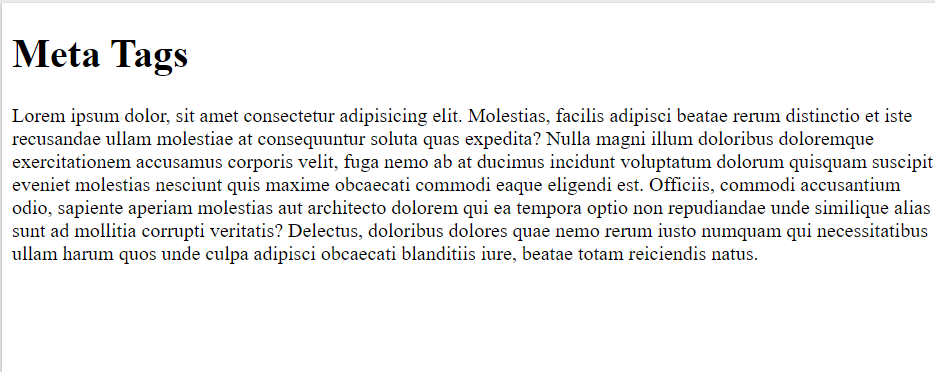

# Introduction to HTML

## Difference Between HTML vs CSS vs JavaScript
| Feature  | HTML | CSS  | JavaScript |
| ------------- | ------------- | ------------- | ------------- |
| Stands For  | Hypertext Markup Language | Cascading Style Sheets | JavaScript |
| Purpose | Defines content and structure of web pages | Defines styles and layouts for web pages | Adds interactivity and behavior to web pages |
| Type of Language | Markup Language | Style Sheet Language | Programming Language |
| Syntax | Uses tags to define elements and attributes | Uses selectors and declarations to style elements | Uses statements and expressions to perform actions and calculations |
| Role | Defines content and structure of web pages | Enhances the presentation of web pages | Adds functionality and interactivity to web pages |
| Examples	| ```<html>, <head>, <body>, <p>, , etc.``` | color, font, margin, padding, etc. | if/else statements, loops, event handlers, etc. |

## Hypertext Markup Language ( HTML ):
*HTML is a markup language used to describe the content and structure of a webpage. It uses a set of tags and attributes to define the structure of the content, such as headings, paragraphs, links, images, tables, and forms. The HTML code is interpreted by the browser to render the webpage, and it tells the browser how to display the content and where to position it on the page.*

### Example: 
```html
<!DOCTYPE html>
<html>
    <head>
        <title>Document</title>
    </head>
    <body>
        <h1>My Heading</h1>
        <p>Lorem ipsum dolor sit amet consectetur adipisicing elit. Iure sit, nam commodi quasi vel facilis molestias? Quis aut doloribus maiores illo repellendus. Facilis harum repudiandae, ullam reiciendis numquam nobis? Commodi repellat illum fugiat nesciunt. Reiciendis, illo quas corporis nesciunt suscipit excepturi! Sit autem ut reprehenderit. Rem temporibus exercitationem id. Autem explicabo veniam quod deserunt alias quisquam officiis accusamus, voluptatum repellendus neque eligendi officia unde dolorum possimus natus corporis iste reiciendis fuga, quam est velit voluptatem facilis laudantium eaque! Veniam beatae repudiandae quibusdam blanditiis eum, aut, doloribus earum adipisci temporibus non ea quasi impedit perferendis doloremque consequuntur accusantium dolore deleniti sint!</p>
    </body>
</html>
```
 

### Output:


# Meta Tags
Meta tags are HTML elements that provide information about a web page to search engines and web browsers. They are placed in the head section of an HTML document and are not visible to website visitors. Meta tags include various attributes such as name, content, and charset, and are used to provide metadata about the document, such as its author, keywords, description, and viewport. Search engines use this metadata to understand the content of a page and to display it properly in search results. Web browsers may also use the metadata to optimize the display of the page, such as setting the viewport size for mobile devices.

### Types Of Meta Tags :
1. ```<meta charset="UTF-8">``` : This tag is used to declare the character encoding of an HTML document.The charset attribute specifies the character set used in the document, which is typically UTF-8, a widely used character encoding that can represent almost all characters in the Unicode character set.

2. ```<meta http-equiv="X-UA-Compatible" content="IE=edge">```: The <meta> tag with the http-equiv attribute and X-UA-Compatible value is used to specify the version of Internet Explorer (IE) that the web page should be rendered in.The value of IE=edge indicates that the web page should be rendered in the highest version of IE available in the browser, regardless of the version that is being used. This helps ensure that the page is rendered properly and functions as expected in all versions of IE.

3. ``` <meta name="viewport" content="width=device-width, initial-scale=1.0">```: This tag is used in HTML to set the viewport of the page.The viewport is the user's visible area of a web page, and it varies depending on the device being used. By setting the viewport with this tag, we can make sure that the web page looks good and is properly scaled on all devices, including desktops, laptops, tablets, and smartphones.The width=device-width attribute sets the width of the viewport to the width of the device, which means the web page will automatically adjust to the size of the device's screen. The initial-scale=1.0 attribute sets the initial zoom level of the web page to 100%, which means the web page will be displayed at its original size when the user first visits the page.

4. ```<title>Meta Tags</title>```: This tag is used to define the title of the HTML document. It is typically placed within the <head> section of the HTML file and is displayed in the title bar of the web browser when the page is opened. The text inside the <title> tag is also used by search engines as the main title for the page in search results. 

5. ```<meta name = "author" content="GFG">```: This meta tag is used to provide information about the author of the webpage. The "name" attribute is used to specify the type of metadata and the "content" attribute is used to define the value of that metadata.

6. ```<meta name = "description" content="This is a description">```: This tag with name="description" is used to provide a brief description of the content of the webpage. It is often used by search engines to display a short summary of the page in search results. The content attribute is where the description text is provided.

7. ```<meta name = "keywords" content= "Movies,top 50 movies,gfg">```: This tag is used to provide the search engines with a list of keywords or phrases relevant to the content of the webpage. These keywords or phrases help search engines to index the webpage properly and improve its visibility in search results.

### Example :
```html
<!DOCTYPE html>
<html>
<head>
    <meta charset="UTF-8">
    <meta http-equiv="X-UA-Compatible" content="IE=edge">
    <meta name="viewport" content="width=device-width, initial-scale=1.0">
    <title>Meta Tags</title>
    <meta name = "author" content="GFG">
    <meta name = "description" content="This is a description">
    <meta name = "keywords" content= "Movies,top 50 movies,gfg">
</head>
<body>
    <h1>Meta Tags</h1>
     <p>Lorem ipsum dolor, sit amet consectetur adipisicing elit. Molestias, facilis adipisci beatae rerum distinctio et iste recusandae ullam molestiae at consequuntur soluta quas expedita? Nulla magni illum doloribus doloremque exercitationem accusamus corporis velit, fuga nemo ab at ducimus incidunt voluptatum dolorum quisquam suscipit eveniet molestias nesciunt quis maxime obcaecati commodi eaque eligendi est. Officiis, commodi accusantium odio, sapiente aperiam molestias aut architecto dolorem qui ea tempora optio non repudiandae unde similique alias sunt ad mollitia corrupti veritatis? Delectus, doloribus dolores quae nemo rerum iusto numquam qui necessitatibus ullam harum quos unde culpa adipisci obcaecati blanditiis iure, beatae totam reiciendis natus.</p>
</body>
</html>
```

### Output :



