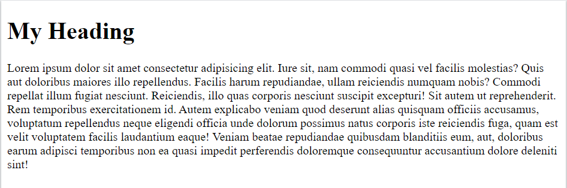

# Introduction to HTML

## Difference Between HTML vs CSS vs JavaScript
| Feature  | HTML | CSS  | JavaScript |
| ------------- | ------------- | ------------- | ------------- |
| Stands For  | Hypertext Markup Language | Cascading Style Sheets | JavaScript |
| Purpose | Defines content and structure of web pages | Defines styles and layouts for web pages | Adds interactivity and behavior to web pages |
| Type of Language | Markup Language | Style Sheet Language | Programming Language |
| Syntax | Uses tags to define elements and attributes | Uses selectors and declarations to style elements | Uses statements and expressions to perform actions and calculations |
| Role | Defines content and structure of web pages | Enhances the presentation of web pages | Adds functionality and interactivity to web pages |
| Examples	<html>, <head>, <body>, <p>, , etc. | color, font, margin, padding, etc. | if/else statements, loops, event handlers, etc. |

## Hypertext Markup Language ( HTML ):
*HTML is a markup language used to describe the content and structure of a webpage. It uses a set of tags and attributes to define the structure of the content, such as headings, paragraphs, links, images, tables, and forms. The HTML code is interpreted by the browser to render the webpage, and it tells the browser how to display the content and where to position it on the page.*

### Example: 
```html
<!DOCTYPE html>
<html>
    <head>
        <title>Document</title>
    </head>
    <body>
        <h1>My Heading</h1>
        <p>Lorem ipsum dolor sit amet consectetur adipisicing elit. Iure sit, nam commodi quasi vel facilis molestias? Quis aut doloribus maiores illo repellendus. Facilis harum repudiandae, ullam reiciendis numquam nobis? Commodi repellat illum fugiat nesciunt. Reiciendis, illo quas corporis nesciunt suscipit excepturi! Sit autem ut reprehenderit. Rem temporibus exercitationem id. Autem explicabo veniam quod deserunt alias quisquam officiis accusamus, voluptatum repellendus neque eligendi officia unde dolorum possimus natus corporis iste reiciendis fuga, quam est velit voluptatem facilis laudantium eaque! Veniam beatae repudiandae quibusdam blanditiis eum, aut, doloribus earum adipisci temporibus non ea quasi impedit perferendis doloremque consequuntur accusantium dolore deleniti sint!</p>
    </body>
</html>
```
 

### Output:
